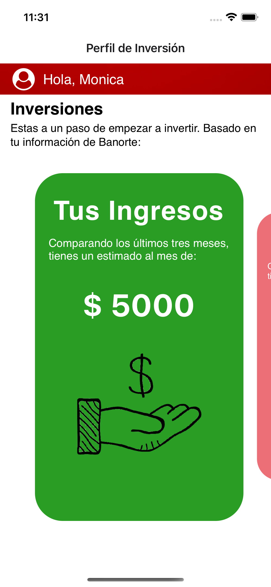
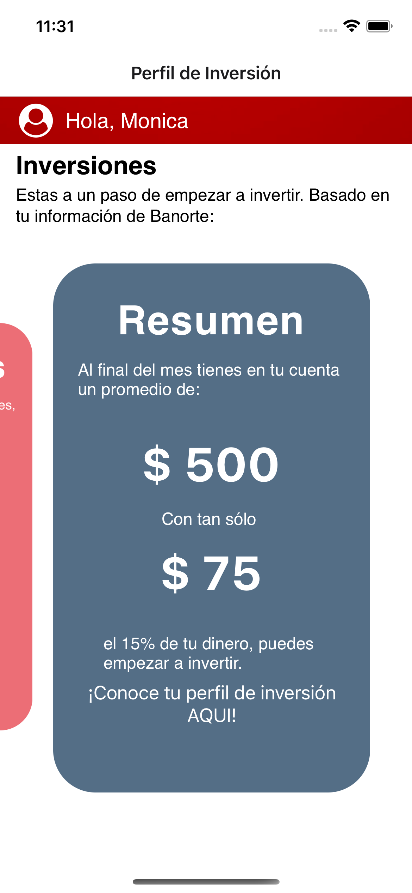
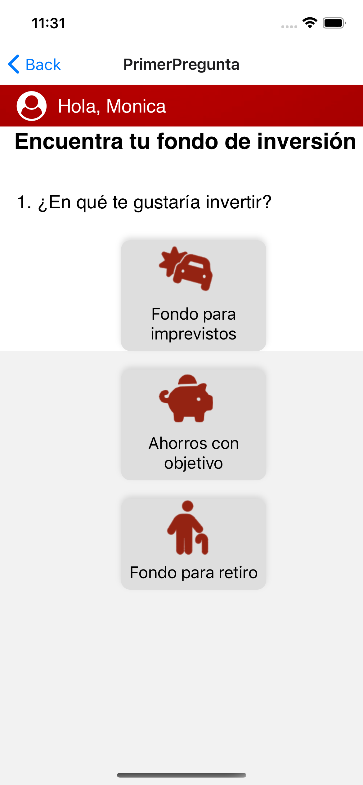
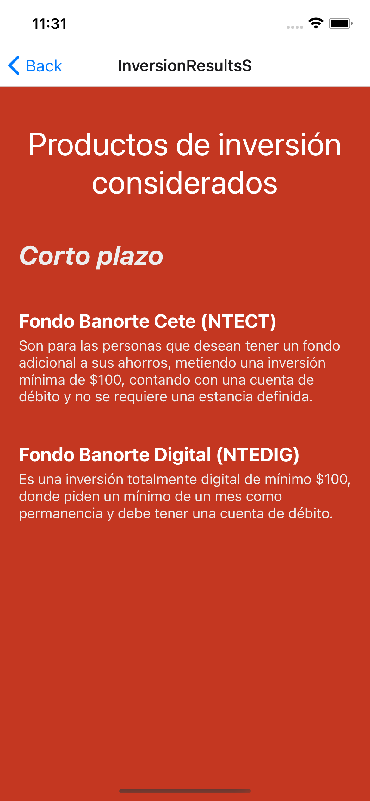

# TRUST: investment coach

Trust is a prototype of a iOS mobile application that offerst financial counseling using AI. This application was made for the Banorte Challenge: Create an investment coach using AI during HackMty 2023 Hackathon.

### Functionality
Based on the user information, income and expenses of a debit card, the application displays a summary of the average transactions in the last 3 months. This feature has enhance connecting to a real time database in Firebase to simulate the structure of Banorte's database. The app displays recommendations for possible Banorte's investments options which are consider suitable for the profile of the user and an amount according to the client expenses to start their investment journey. It also includes the prototype of a chatbot integrated with artificial intelligence using Open AI that answers questions about investments.

The application was designed to be implemented in the existing Banorte's mobile application.

### Contributions

This application could not have been made possible without: 
- Sara Vargas
- Evelyn Esquivel
- Monica Escobedo
